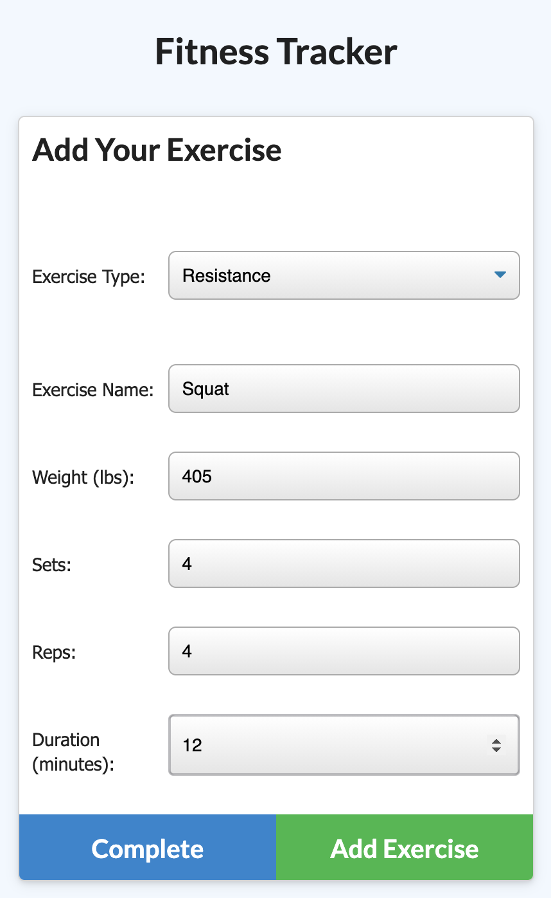

# Workout Tracker

This fitness tracker allows users to track activities labeled under Resistance and Cardio from the created Mongo Database, including preloaded information from Mongoose schemas and handled through the use of Express Routes.

[Link to GitHub Repository](https://github.com/WitnessMyHands/Workout-Tracker)

[Link to Heroku Deployed Application](https://wmh-fitness-tracker.herokuapp.com/)

## Table Of Contents

- [Description](#Description)
- [Installation](#Installation)
- [Gallery](#Gallery)
- [License](#License)
- [Questions](#Questions)

## Description

This project consists of the following:
* HTML
* CSS
* Javascript
* Node.js
* Express
* MongoDB
* Heroku

## Installation
- Clone the Repository using Terminal: `git clone git@github.com:WitnessMyHands/Workout-Tracker.git`
- Change directory, "cd" into the Appropriate Folder
- First install your packages with: `npm i`
- To run the Application you will need to run: `npm start`

## Gallery

- Example of Fitness Tracking using the Cardio Dropdown Menu

- Example of Fitness Tracking using the Resistance Dropdown Menu

## License

## Questions
*Please contact WitnessMyHands via GitHub with any questions or concerns.*

- https://github.com/WitnessMyHands
